

  <

# Bogotá y la inclusión social. 

## 1.	¿Cuál es el problema a tratar?

Bogotá es la ciudad de Colombia que más población acoge en todo el país por diferentes razones, entre ellas, la principal es que, al ser la capital, es el lugar donde más confluyen dinámicas económicas y por ende si se realiza una discriminación de aporte de puntos al PIB por región, Bogotá lleva la delantera; se estima con cifras que el PIB total del país a 2018 ascendía a 985.931, de los cuales 252.511 provenían de la ciudad (Medido en miles de pesos). 
Así mismo, al ser una ciudad con una dinámica voraz, necesita políticas eficientes para todos sus habitantes, de los cuales el 5,9% corresponde a población en situación de pobreza extrema; y el 12.4% se encuentra en índices de pobreza tasable pero no con índices de Necesidadesas Insatisfechas (NBI) apropiados. Esto, llevado a porcentajes, en suma, indica que el 18,3%* de la población en Bogotá requiere atención social permanentemente.*
Así mismo, al ser una ciudad con una dinámica voraz, necesita políticas eficientes para todos sus habitantes, de los cuales el 5,9% corresponde a población en situación de pobreza extrema; y el 12.4% se encuentra en índices de pobreza tasable pero no con índices de Necesidades NBI apropiados. Esto, llevado a porcentajes, en suma, indica que el 18,3%* de la población en Bogotá requiere atención social permanentemente.*

La Alcaldía, consciente de la situación de la población en mención ha puesto en marcha una serie de programas inclusivos que trabajan con población en situación de vulnerabilidad; sin embargo, para un ciudadano que recorra la cuidad a diario parecería no ser suficiente porque constantemente se evidencian las mismas problemáticas de ausencia distrital; esto, se debe más a falta de socialización con los programas existentes y al conocimiento de cada uno, es decir a la masificación de la difusión de información. 
_______________________________________________________________________________________________________________________________________________________________________
*Fuente DANE, 2020.

## 2.	¿Por qué los datos geográficos ayudan a resolverlo?

Pareciera casi un dogma que los estratos sociales menos favorecidos son los que más atención social requieren; por tanto, si se realiza un análisis proporcional a la cantidad de infraestructura disponible para la atención de eventos por zona en función del estrato; además de la cercanía entre un punto de atención y el otro, se puede determinar qué tan útil resulta la infraestructura disponible y cuáles zonas quedan desatendidas por la lejanía de centros de atención. 

## 3.	Descripción de la solución propuesta.

La solución que se plantea es recopilar los datos disponibles en el repositorio de IDECA, cruzarlos con los estratos socioeconómicos y validar cuáles localidades deben recibir atención de infraestructura, además de la concentración de sitios de atención por localidad. Posteriormente, se plantea validar con una capa de uso del suelo cuáles podrían ser las potenciales ubicaciones sobre las cuales el DPS podría poner la mira para realizar adquisiciones inteligentes de predios en función del uso que le sirve a dichos centros(Dotacional). Esto para realizar un primer acercamiento sobre ubicaciones estratégicas de las zonas de atención. 

## 4.	Listado detallado de las fuentes de datos seleccionadas. Mínimo 3 conjuntos de datos. Incluir información del proveedor de los datos, enlace para descarga, título y descripción del conjunto de datos, descripción de los atributos principales a utilizar.

Atributibamente hablando los conjuntos de datos tienen el mismo estándar, están configurados para mostrar horarios de atención, dirección, teléfono, localización y sector catastral en el que se encuentra. 

La fuente de datos proviene de IDECA, a continuación se lista la fuente de datos y se enuncia el enlace donde se encuentra disponible. 

| Insumo       | Descripción          | Fuente  |
| -------------|:-------------:| -----:  |
| Manzanas Bogotá| Conoce las unidades geográficas tipo manzana las cuales se les asocia la variable de estrato socioeconómico, siendo esta, la clasificación de los inmuebles residenciales que deben recibir servicios públicos. Se realiza principalmente para cobrar de manera diferencial por estratos los servicios públicos domiciliarios, permitiendo asignar subsidios y cobrar contribuciones. | https://www.ideca.gov.co/recursos/mapas/      
| Centros Proteger | Espacio donde se brinda atención integral para la garantía de derechos de niños, niñas, adolescentes en edades comprendidas entre 0 a 9 años 11 meses y hermanos con edad hasta 10 años 11 meses cuyos derechos se encuentran inobsevardos, amenazados o vulnerados, en espacios que garantizan la protección y ambientes propicios para llevar a cabo procesos de restablecimiento de derechos a niños, niñas y adolescentes los cuales buscan reparar el daño causado y crear contextos que posibiliten la construcción de individuos integrales para el efectivo goce de sus derechos.     |  https://www.ideca.gov.co/recursos/mapas/centro-proteger-bogota-dc   |
| Centros Creciendo en Familia| Espacio donde se presta servicio de atención integral a mujeres gestantes, niñas y niños menores de dos años de edad en el marco de la Ruta Integral de Atenciones a la Primera Infancia -RIA- que promueve el desarrollo infantil desde el fortalecimiento de las capacidades para educar, cuidar y proteger de madres, padres, cuidadores y agentes comunitarios en los entornos hogar y espacio público.   |    https://www.ideca.gov.co/recursos/mapas/creciendo-en-familia-bogota-dc |
| Centros Amar| Espacio donde se presta servicio de atención integral con enfoque diferencial a niñas, niños y adolescentes en riesgo o en situación de Trabajo Infantil ampliado y sus familias, para fortalecer y contribuir a su desarrollo integral, garantía y restablecimiento de sus derechos, a través de actividades pedagógicas, cuidado calificado, apoyo alimentario con calidad y oportunidad y promoción de la corresponsabilidad de las familias en entorno social.     |   https://www.ideca.gov.co/recursos/mapas/centro-amar-bogota-dc  |
| Centros Forjar | Espacio donde se presta servicio especializado de atención integral con enfoque de derechos diferencial a los adolescentes y jóvenes mayores de 14 años vinculados al sistema de Responsabilidad Penal para Adolescentes (SRPA) sancionados con Prestación de Servicios a la Comunidad y Libertad Asistida/ Vigilada y el apoyo para la Administración de Justicia en el Proceso Administrativo de Restablecimiento de Derechos - PARD, a través de la implementación de una propuesta educativa, protectora y restaurativa cuyo propósito es la garantía y restablecimiento de sus derechos y promociona la corresponsabilidad de las familias.    |   https://www.ideca.gov.co/recursos/mapas/centro-forjar-bogota-dc    |
| Atención social Víctimas de violencia intrafamiliar | Servicio en el que se busca la adecuada, oportuna, eficaz garantía, protección y restablecimiento de los derechos de las personas involucradas en conductas atentatorias de la Armonía y la Unidad Familiar.   |    https://www.ideca.gov.co/recursos/mapas/atencion-victimas-violencia-intrafamiliar-cavif-bogota-dc  |
| Localidades Bogotá | División del territorio Distrital, teniendo en cuenta las características sociales de sus habitantes y de acuerdo al reparto de competencias y funciones administrativas asignadas por el Concejo Distrital.    |    https://www.ideca.gov.co/recursos/mapas/localidad-bogota-dc

*Descripciones tomadas de conjunto de Datos IDECA. Fuente IDECA Bogotá. 

## 5.	Descripción detallada del procesamiento no trivial realizado a los datos (algoritmos, herramientas utilizadas, modelos, etc)
 
Se debe separar el análisis en dos partes, de las cuales una se realizó con procesos manuales y la otra se realizó con un geoproceso que se describe a continuación: 

  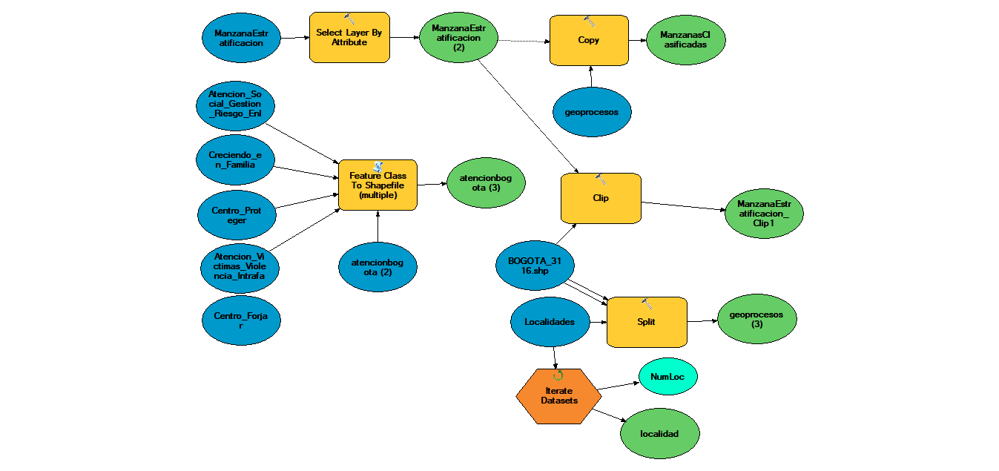 

Figura 1. Fuente: Propia. 

En este modelo se explica la depuración de la información y el cruce que se hizo para realizar las validaciones posteriores sobre las densidades de infraestructura existente. 

El modelo se divide en dos partes, una contiene los datos de entrada y una selección por categorización de estrato en cada localidad de Bogotá. 

Acto seguido, se unifican los centros de atención recopilados en IDECA en una sola gdb y se procede a utilizar dicha información para depurarse por localidad. Esto con el fin de tener un resultado final por localidad de las manzanas objeto de estudio y poder determinar cuáles reciben o no la atención de infraestructura suficiente. 

Para determinar dicha suficiencia, se utiliza un modelo de densidad sobre una superficie a partir de un punto, para ello se utiliza una de tipo kernel con los datos en cuestión como se muestra a continuación: 

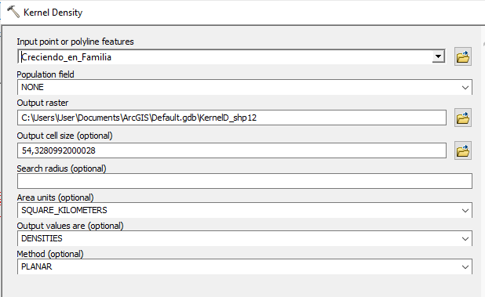 
Figura 2. Fuente: Propia. 

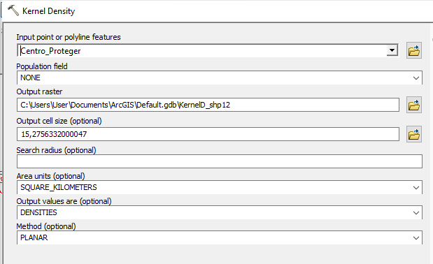
Figura 3. Fuente: Propia. 

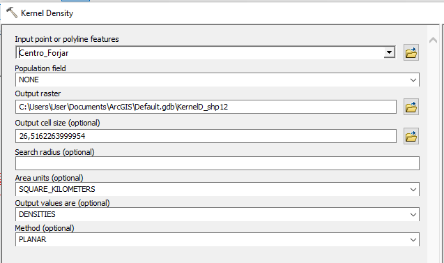 
Figura 4. Fuente: Propia. 

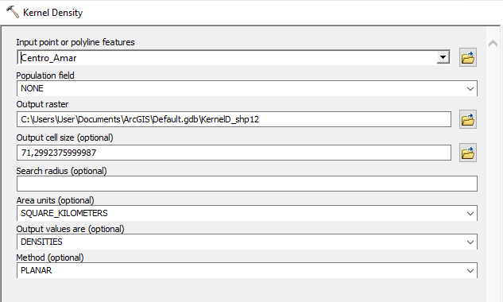  
Figura 5. Fuente: Propia. 

Finalmente se generan mapas de clústeres sobre los que se puede evidenciar si la población está siendo o no atendida como sigue: 

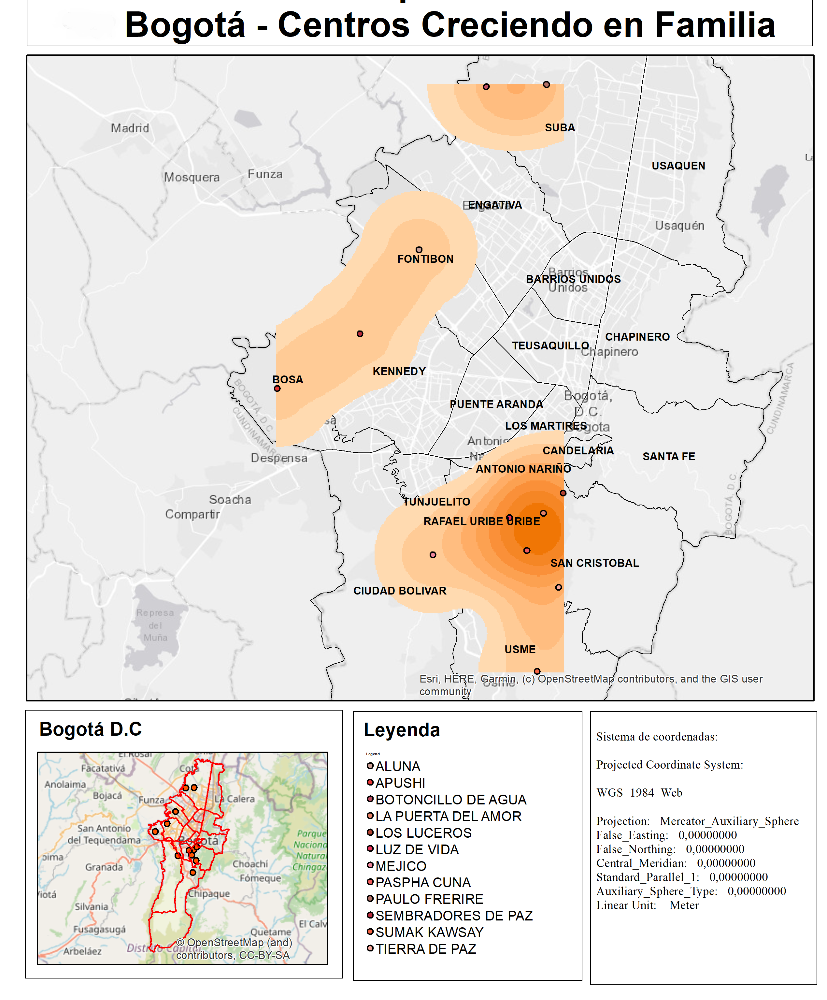
Figura 6. Fuente: Propia. 

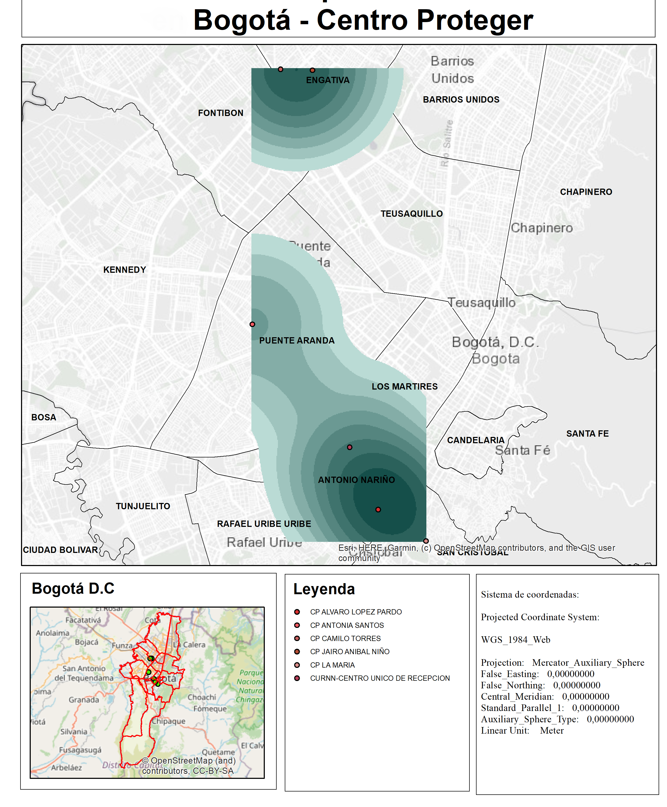
Figura 7. Fuente: Propia. 

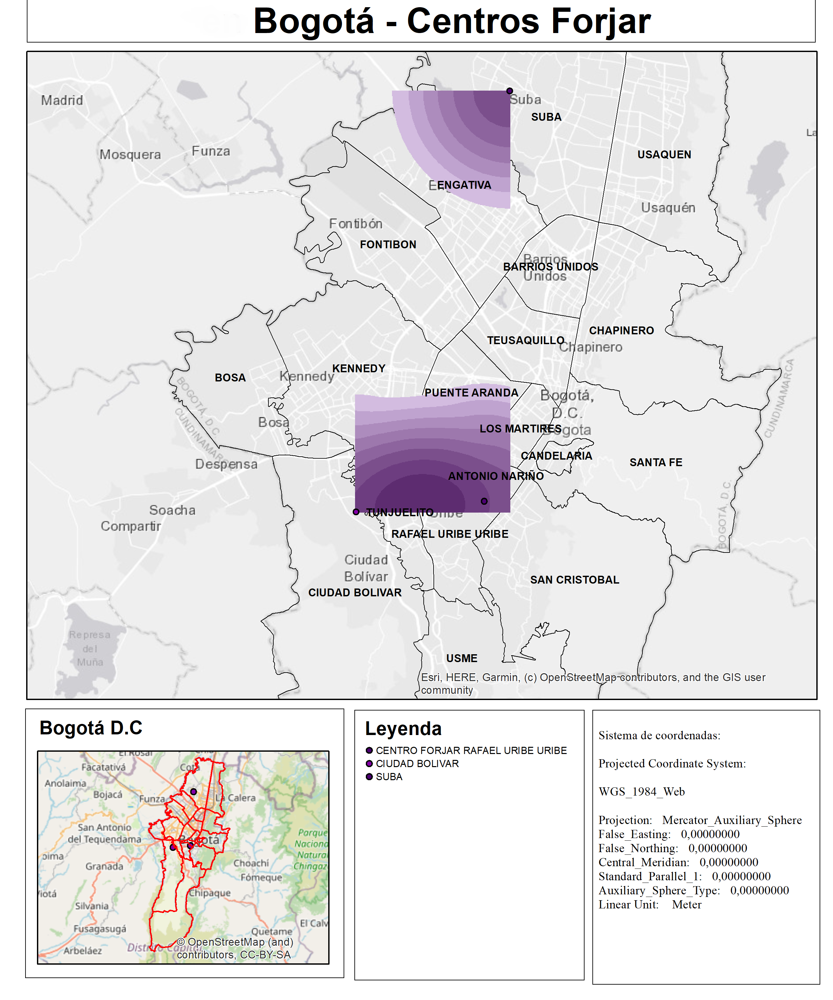
Figura 8. Fuente: Propia. 

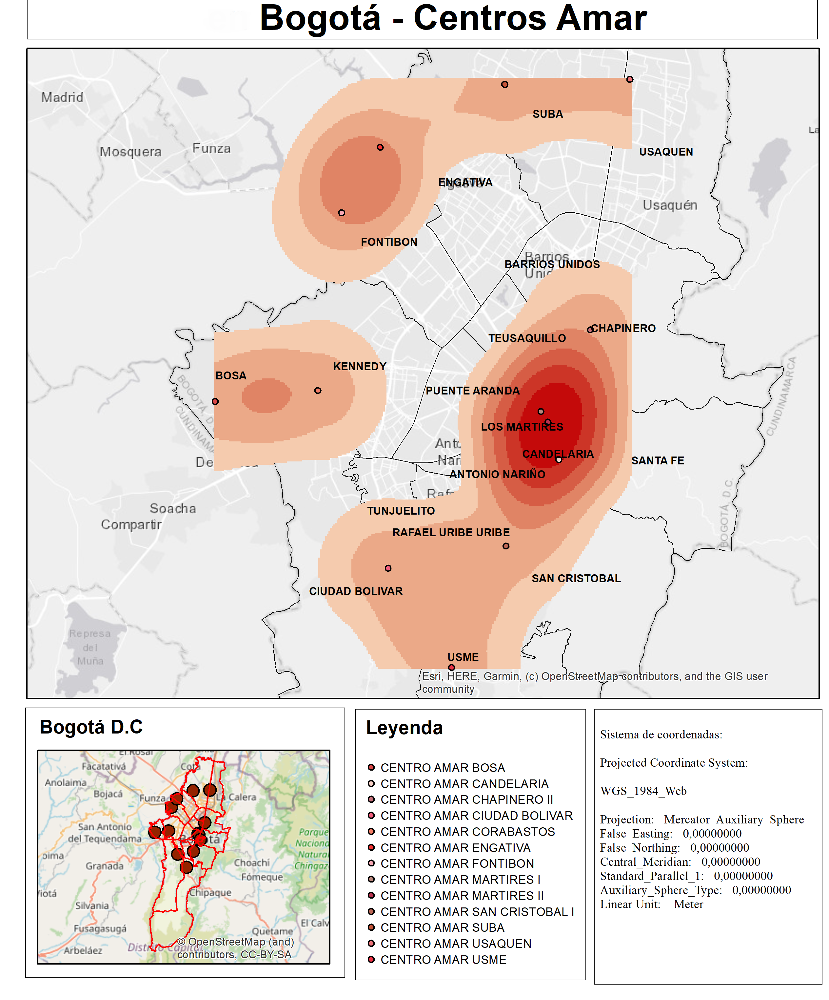
Figura 9. Fuente: Propia. 

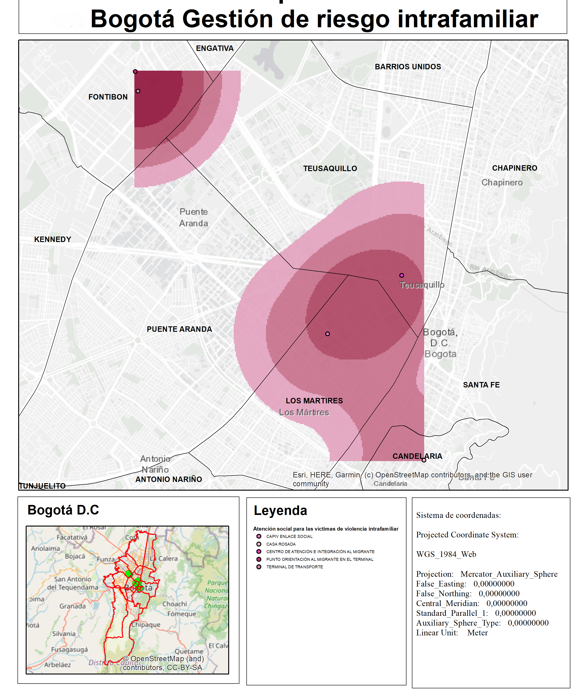
Figura 10. Fuente: Propia. 

Finalmente se realizó una validación de los puntos que eran objeto de la zona de estudio y su distribución espacial por la ciudad. 

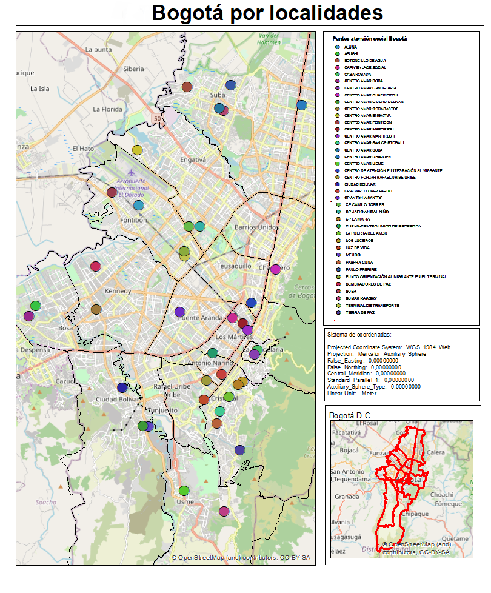
Figura 11. Fuente: Propia. 

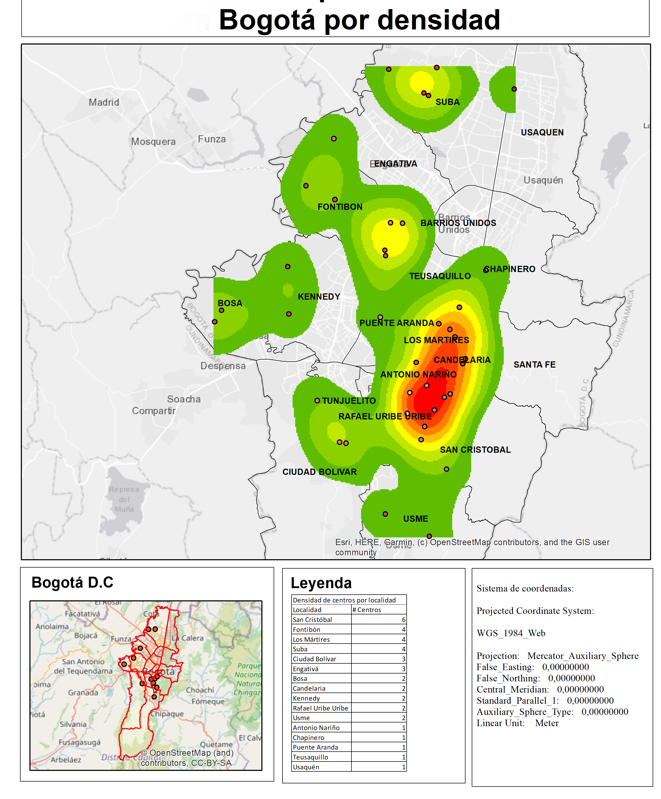
Figura 12. Fuente: Propia. 

Se pudo evidenciar que no se suplen las necesidades donde deberían ser atendidas en principio. 

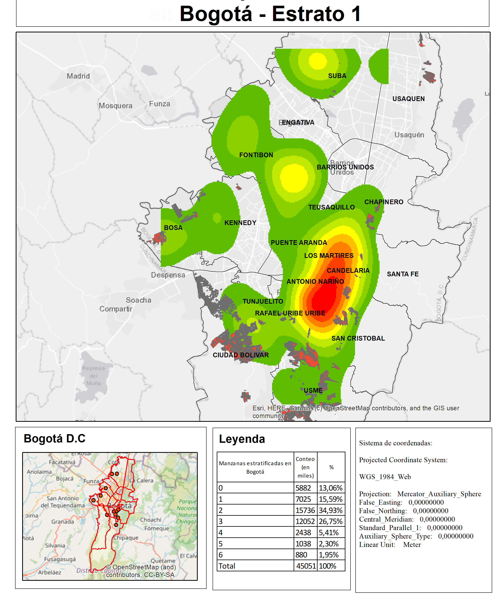
Figura 13. Fuente: Propia. 

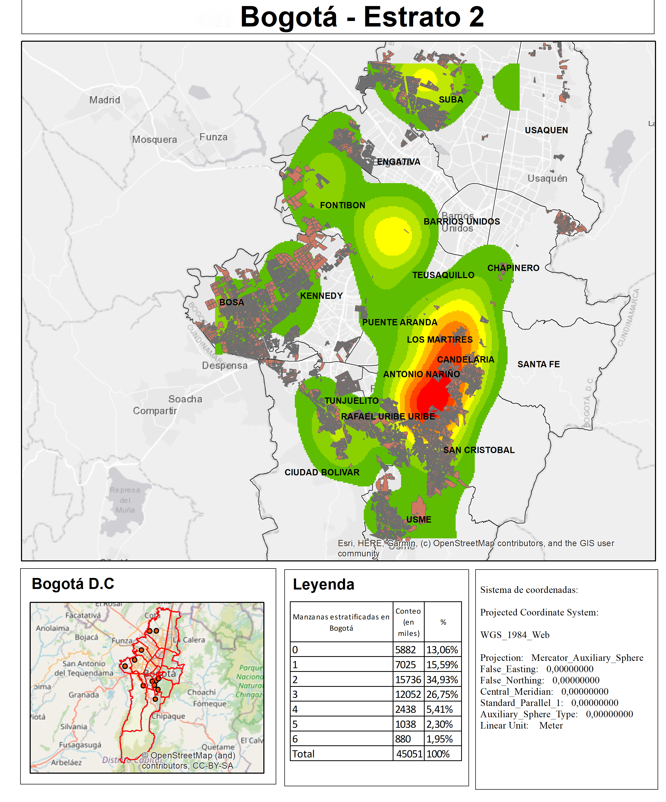
Figura 14. Fuente: Propia. 

También, fue necesario generar una salida por cada localidad con su respectiva cantidad de manzanas inatendidas. Al realizar las validaciones sobre el ejercicio, se evidencia que no se pueden realizar publicaciones de archivos ráster de una manera rápida, por lo que se procede a realizar un buffer que sería el análogo a las validaciones de clústeres o densidades de tipo vector, para lo que se usan áreas de 5.000m2 que equivalen a lo que debería recorrer una persona diariamente por trayecto para ejercitarse. (10.000ml en total). 

Este análisis se propone bajo el supuesto de buscar que las personas puedan ser atendidas sin tener que incurrir en gastos de transporte debido a su condición de vulnerabilidad por localidad y manzana. (Mismos resultados evidenciados en el geoproceso de la figura 1.), con lo cual se evidencian los siguientes resultados: 

## 6.	Descripción detallada de la metodología utilizada para generar los mapas (atributos seleccionadas, métodos de clasificación, colores, etc)

Se realizó trabajo dividido en dos segmentos, uno con análisis ráster y otro realizando una serie de geoprocesos citados en la figura 1. 

Posteriormente se seleccionaron los centros de atención que realizan trabajo social sobre la población y se generó una densidad de tipo kernel para saber cuáles de esas poblaciones están desatendidas. Se realiza el mismo procedimiento con cada centro de atención. 

Finalmente se utiliza una capa que contiene todos los centros de atención (producto de la figura 1) y se realiza el mismo análisis de clúster con salidas tipo vector para validar la misma variable en conjunto sobre la ciudad.

## 7.	Descripción detallada del procedimiento técnico utilizado para generar los mapas (plugins, extensiones, procesos, transformaciones de datos, etc). Ejemplos de herramientas: Qgiscloud , leaflet, QGIS2Web , Github Pages, kepler.gl, flourish, etc.

Se utilizaron varias herramientas, utilicé en un principio QGIS2web para la publicación de los puntos de atención, y los buffer sobre cada localidad. 

Utilicé además GitHub para la realización de cargue de datos y Colorbrewer para la asociación de la gama de colores idónea para la realización de las salidas gráficas.

Utilicé además la referencia citada en la tabla para poder realizar un cargue de imágenes con tamaño detemrinado, el cual se consultó en el sigueinte enlace. 

| Insumo       | Descripción          | Fuente  |
| -------------|:-------------:| -----:  |
| StackOver para cambiar tamaño de imágenes|Resources disponibles para el cambio de tamaño en la resolución que ocupa una imagen en la pantalla| https://stackoverflow.com/questions/14675913/changing-image-size-in-markdown/21972032#21972032 |

## 8.	Adicionar al repositorio github los archivos generados (ejm. html) en la subcarpeta Tarea_1/html/

https://github.com/caduci15/CartoWeb/tree/master/Tarea_1

## 9.	Urls de los mapas publicados en la web

https://caduci15.github.io/CartoWeb/Tarea_1/mapa/index.html

## 10.	Conclusiones Ventajas / desventajas / dificultades encontradas durante el desarrollo del ejercicio

## Conclusiones: 

Del ejercicio en general: 

En primera instancia, los datos que iban a ser utilizados para este ejercicio no eran de fuente IDECA. El primer ejercicio se pensó en dos focos, uno, en el sector educación y otro en la población en condición de calle. Absolutamente todos los datos tenían origen o bien en el portal de datos del DANE, o en la página oficial de datos de la Nación (https://www.datos.gov.co/), de lo cual se concluye que es un ejercicio demasiado desgastante, los portales de datos en Colombia aún tienen un camino extenso por recorrer en lo que a interoperabilidad refiere, el primer acercamiento fue al portal de datos abiertos del DANE (http://anda.dane.gov.co/index.php/catalog/MICRODATOS/about), y no hubo respuesta positiva. Los datos se pueden descargar únicamnete en extensión .SAV, al hacer una validación sobre ese tipo de extensiones, se encontró que son nativas de SPSS y no son de fácil lectura sin software especializado, no existe ninguna extensión que permita la consulta de los datos abiertamente y menos realizar operaciones espaciales. Posteriormente, se hizo un acercamiento sobre el Geoportal propiamente para validar la descarga de datos en formato geográfico, sin éxito alguno, únicamente están publicados los datos básicos de límites administrativos y ninguna de las encuestas que realiza la institución. 

Se realizó una consulta posterior al portal de Datos de la Nación, donde el acercamiento tampoco fue amigable. Se realizó un filtro sobre datos que pudieran ser utilizables con geometrías y se validaron los posibles formatos de exporte, donde únicamente se habilita la opción de CSV, no en formato Geojson, un Json, Shp, Gepackage, pese a que los datos en teoría eran "espaciales". Se intentó descargar un CSV y realizar geocodificación pero sucedían dos fenómenos, por un lado, las geocodificaciones que se podían realizar en software Opensource como Google permitían un límite de datos que no alcanzaba a ser el universo de estudio planeado previamente, y por otro lado, al intentar espacializarlo, de igual modo para a posterior realizar uniones y cortes sobre los datos y depurar, se encontró que las bases de datos publicadas no contaban con dos parámetros: uno de metacalidad donde se validara la integridad de los datos (los campos estaban cruzados unos con otros para geocodificar por dirección y localidad, por ejemplo) y segundo, tampoco contaba con un metadato que explícase de modo puntual qué indicaba cada variable para saber cómo realizar una depuración consciente de los datos. De ahí se pudo inferir que a los portales de datos abiertos existentes en el país les hace falta un camino bastante extenso por recorrer en lo que refiere a integración de tecnologías espaciales y de implantación de normas ISO de calidad de datos (análogo a las NTC 5043 y 4611 para datos geográficos). 

Con los datos empleados surge una considerable serie de preguntas sobre la población en la que se centra la atención del DPS, los resultados evidencian que la infraestructura no está encaminada en absoluto a atender los focos a donde debería ir dirigida, por lo que debería repensarse si realmente se están proyectando las ayudas ofrecidas en la dirección correcta. Cabe destacar además que el DPS incluye una estratificación cero (0) en sus datos, lo cual bajo el estándar técnico de asignación de estratificación y los criterios de hábitat que formulan dichos planteamientos no debería incluir dicho estrato como un índice socieconómico y sí como la ausencia de estrato por uso o destino del predio en mención. 

Con las herramientas, surgen varios interrogantes, el primero es el tamaño máximo que permite cargar QGIS2Web, pues se intentó realizar un cargue de las manzanas objeto de estudio, y aunque se atendió la premisa socializada en clase de tamaño de cargue de archivos, no fue exitosa la operación por superar la cantidad de unidades posibles para analizar, por lo que en algún punto se replanteó el modelo para mostrarse por localidad y no en general. 

Se entiende de antemano que Qgis2web no es funcional para datos ráster, para ello se pensó usar Geoserver pero los tiempos no se ajustaron a dicha solución para poder mostrar los resultados del estudio bajo un modelo ráster. 

Del estudio puntualmente: 
>

