## 1.  Definición del problema 

# Estudio de atención a población en situación de calle en Bogotá D.C. 

La población en situación de calle en Bogotá alcanza a ser de casi 7.000 habitantes (DANE, 2017), los cuales representan el 0,9% de la población total de la ciudad; sin embargo, a dcha población se le mantiene en un rezago político-social que no es pertinente ni idóneo pensando que la drogadicción, al igual que otras problemáticas sociales, desencadenan inexorablemente en problemas de salud pública. 

Es por eso, que este estudio, busca por un lado, mapear el último Censo de Habitantes de calle que realizó el DANE en Bogotá (2017) para dar cuenta de la distribución de dichsa población en la ciudad, además busca relacionar cada habitante con un centro u hogar de paso de los once (11) disponibles que tiene el distrito para su atención. Con esto, se busca además evidenciar que los centros existentes no son suficientes para atender dicha población. 

A continuación se listan los centros de atención disponibles para el habitante de calle y la población objeto de estudio según las cifras del censo: 

| CENTRO       | NOMBRE        | DIRECCIÓN     | TELÉFONO      | HORARIO ATENCIÓN |
| -------------|:-------------:|:-------------:|:-------------:|-------------:   |
| 1	           | EL CAMINO - COMUNIDAD DE VIDA	| KR 69 47 87	| 4105461 | LUNES A DOMINGO 24 HORAS |
| 2	           | HOGAR DE PASO DÍA - NOCHE 2 CARRERA 35 | KR 35 10 35	| 2016810	| LUNES A DOMINGO 24 HORAS |
| 3            | CENTRO DE ATENCION TRANSITORIA-CAT | KR 35 10 69 | 2478038 | LUNES A DOMINGO 24 HORAS |
| 4        	   | HOGAR DE PASO DIA - NOCHE 1 BAKATÁ | CL 10 17 15	| 2821859 | LUNES A DOMINGO 24 HORAS |
| 5	           | LA ACADEMIA - CENTRO DE FORMACION PARA EL ESTUDIO	| CL 12 16 73 | 2824921 | LUNES A DOMINGO 8:00 AM - 4:00 PM |
| 6	           | COMUNIDAD DE VIDA ALTA DEPENDENCIA FUNCIONAL	| LA MESA VEREDA LA TRINITA	| 3808330 | LUNES A DOMINGO 24 HORAS |
| 7	           | COMUNIDAD DE VIDA RICAURTE | RICAURTE - VEREDA LLANO DEL POZO - HACIENDA YIRED | 3808330	| LUNES A DOMINGO 24 HORAS |
| 8	           | HOGAR DE PASO DÍA NOCHE CRA 13 | 	KR 13 18 36	| 3808330	| LUNES A DOMINGO 24 HORAS |
| 9	           | HOGAR DE PASO CALLE 18 | CL 18 13 47 | 3411186 | LUNES A DOMINGO 24 HORAS |
| 10           | HOGAR DE PASO 5 CASA AZUL - MUJERES DIVERSAS	| CL 24 19 A 35	| 3279797 | LUNES A VIERNES DIURNO 7:00 AM - 7:00 PM - NOCTURNO 7:00 PM - 7:00 AM - DOMINGOS Y FESTIVOS: 7:00 AM - 7:00 PM |
| 11           | HOGAR DE PASO 6 - CARRETEROS	| CL 18 14 36 | 3279797 | LUNES A VIERNES DIURNO 7:00 AM - 7:00 PM - NOCTURNO 7:00 PM - 7:00 AM - DOMINGOS Y FESTIVOS: 7:00 AM - 7:00 PM |
Fuente: IDECA, Bogotá. 

  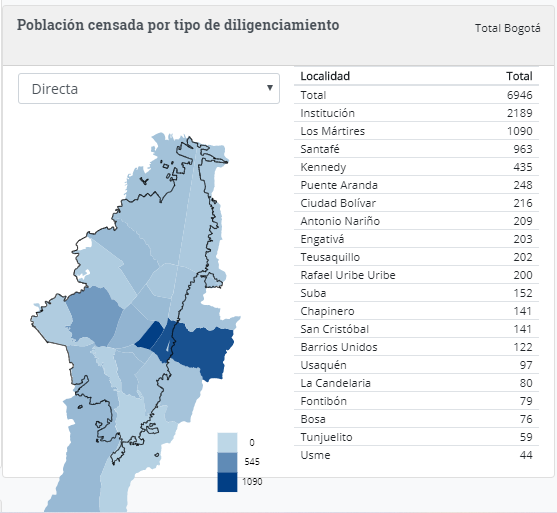 
   Figura 1. Fuente: DANE - Censo Habitantes de Calle, 2017.  

2.  Fuentes de datos

Los conjuntos de datos que se usaron para el ejercicio, no todos obedecen a datos con geometrías, como es el caso del Censo del DANE, esos datos fueron espacializados con procedimiento que se explica más detalladamente adelante. 

Los demás se listan a continuación: 

| Insumo       | Descripción          | Fuente  |
| -------------|:-------------:| -----:  |
| Localidades Bogotá | División del territorio Distrital, teniendo en cuenta las características sociales de sus habitantes y de acuerdo al reparto de competencias y funciones administrativas asignadas por el Concejo Distrital.    |    https://www.ideca.gov.co/recursos/mapas/localidad-bogota-dc |
| Atención Integral a Ciudadanos Habitantes de Calle. Bogotá D.C. | Espacio donde se atienden ciudadanos y ciudadanas habitante, o en riesgo de habitar calle, de 29 años en adelante, para promover el avance en procesos de inclusión social a través de acciones y estrategias en el corto y mediano plazo que permita el restablecimiento de derechos, la vinculación a redes de apoyo y la proyección de metas personales. | https://www.ideca.gov.co/recursos/mapas/atencion-integral-ciudadanos-habitantes-de-calle-bogota-dc | 
| Censo habitantes de calle Bogotá | Conjunto de datos que recolectó el Censo de Habitantes de Calle para Bogotá 2017 (Datos no espaciales) | https://www.dane.gov.co/index.php/estadisticas-por-tema/demografia-y-poblacion/censo-habitantes-de-la-calle-bogota / https://sitios.dane.gov.co/habitantes-calle-2018/ | 

3. Procesamiento de datos

## Espacialización de datos DANE

Para proceder a la espacialización de loa datos, se consolidó primero una tabla con los campos que se necesitan contar, seguido de los habitantes de calle por localidad y el porcentaje que representa cada suma en la totalidad de existencia de poblacion en situación de calle en Bogotá. Esto con el fin de poder generar puntos sobre las localidades que representen cada habitante en una ubicación determinada. Para ejercicios prácticos y dada la condición de calle que presenta el habitante y su situación de itinerancia en el sitio empleado para pernoctar, lo único relevante para el estudio es la ubicación en la localidad. 

| Localidad    | Habitantes por localidad (En miles) | Porcentaje del total  | Porcentaje acumulado |
| -------------|:-------------:| :-------------:| -----:  |	 	
| Los Mártires	| 1090	| 22,91%	| 22,91% | 
| Santafé	| 963	| 20,24%	| 43,16% | 
| Kennedy	| 435	| 9,14%	| 52,30% |
| Puente Aranda	| 248	| 5,21%	 | 57,52% | 
| Ciudad Bolívar	| 216	| 4,54%	| 62,06% | 
| Antonio Nariño	| 209	| 4,39%	| 66,45% | 
| Engativá	| 203	| 4,27%	| 70,72% | 
| Teusaquillo	| 202	| 4,25%	| 74,96% |
| Rafael Uribe Uribe	| 200	| 4,20%	| 79,17% |
| Suba	| 152	| 3,20%	| 82,36% |
| Chapinero	| 141	| 2,96%	| 85,33% |
| San Cristóbal	| 141	| 2,96%	| 88,29% |
| Barrios Unidos	| 122	| 2,56%	| 90,86% |
| Usaquén	| 97	| 2,04%	| 92,89% |
| La Candelaria | 80	| 1,68%	| 94,58% |
| Fontibón	| 79	| 1,66%	 | 96,24% |
| Bosa	| 76	| 1,60%	| 97,83% |
| Tunjuelito	| 59	 | 1,24%	| 99,08% | 
| Usme	| 44 | 	0,92%	| 100,00% |
| Totales	| 4757 |	100,00%	| 100,00% |
*Aquí cabe destacar que hay un porcentaje que no se cuenta en los datos espacializados y son los 2.189 habitantes que ya están censados y debidamnete ubicados en centros de atención especializados.

Después de la tabulación, se procede a realizar una generación de puntos aleatorios por localidad como se muestra en las siguientes figuras, se realiza el proceso en las 19 localidades para demostrar visualmente la alta inmersión de población en condición de calle en la ciudad; sin embargo, para efectos del ejercicio práctico, solo se trabajará con la localidad de Kennedy que es la tercera en densidad poblaciones y permite visualizar una mejor distribución de los datos. 

  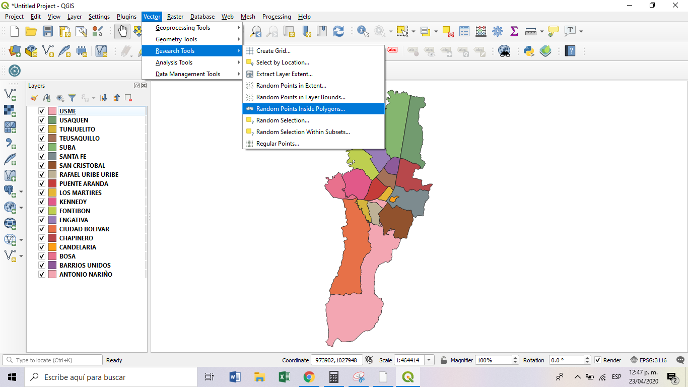 
   Figura 2. Fuente: Propia.  

  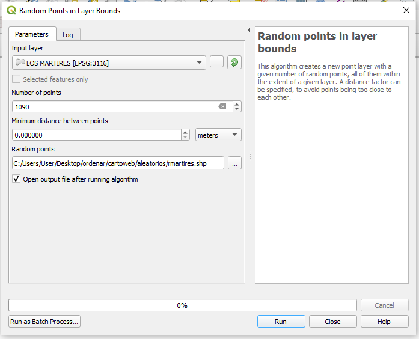 
   Figura 3. Fuente: Propia.  

  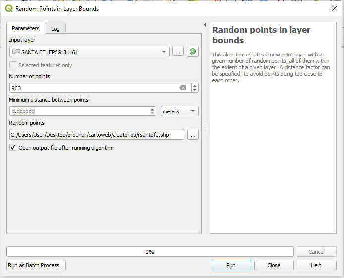 
   Figura 4. Fuente: Propia.  

En las figuras 5 y 6 se evidencia el resultado por localidad y el general de la ciudad por habitantes. 

  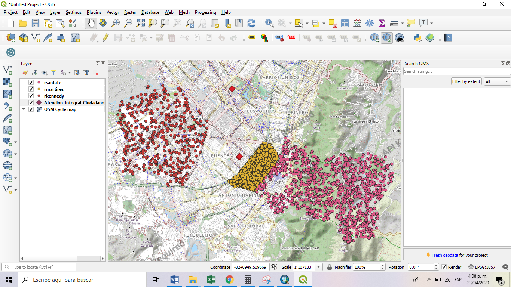 
   Figura 5. Fuente: Propia.  

  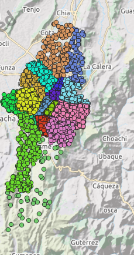 
   Figura 6. Fuente: Propia.  

Seguido a eso, se quiere validar cuáles deberían ser los flujos de migración de la población de calle hacia los centros de atención existentes. En este punto cabe resaltar que se utilizaron cuatro puntos teniendo en cuenta que existe una mayor cantidad de población concentrada en el centro de la ciudad y que los puntos de atención existentes en la zona ya están copados. Además para hacer la validación del ejercicio visual de desplazamiento que se debe efectuar con cada persona para que se pueda dar por cumplida la atención social que requieren. 

Cabe destacar que esto es un ejercicio meramente académico para evidenciar la ausencia de centros de atención que suplan las necesidades de la población porque los existentes superan la capacidad instalada con la demanda requerida. 

Para realizar esta prueba, se realiza una extracción de las coordenadas, inicialmente con funciones en PostGIS, usando st_x(geom) y st_y(geom), pero al intentar realizar un update a la tabla de los valores extraídos en nuevos campos, se obtiene un error que no se entiende cómo solucionar, por lo que se deja en pausa y se procede a extraer los datos con un field calculator de QGIS como se muestra en las figuras 7 y 8. 

  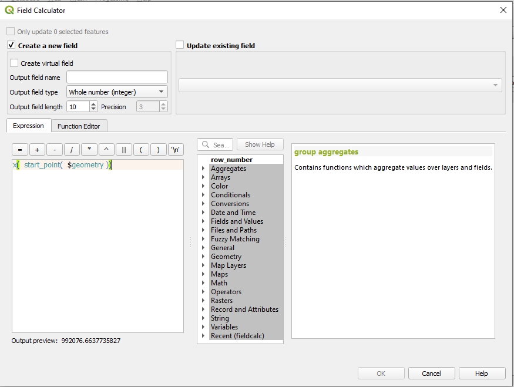     &nbsp;&nbsp;&nbsp;  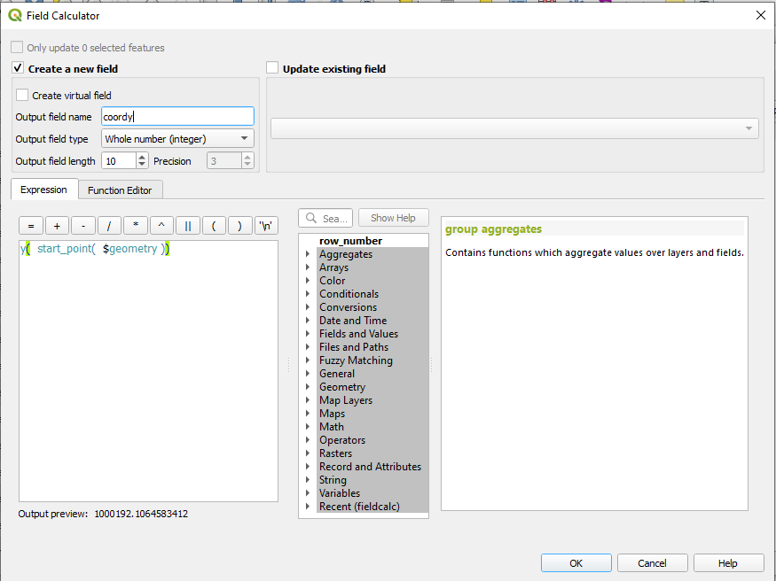      
                                  Figura 7 y 8. Fuente: Propia.  

 

Posterior al cálculo de las coordenadas, se genera una función que extraiga el origen y el destino de los puntos y que trace una línea entre ambos, representando la distancia geodésica entre ambos (entiéndase el planteamiento geodésico de los datos y no euclidiano, teniendo en cuenta la potencial superación de kilómetros de distancia donde la curvatura de la tierra ya empieza a sentir excentricidades mayores a uno), teniendo como resultado la figura 11.

La figura 10 es el resultado del proceso cuando se pensó el estudio inicialmente para las localidades con mayor concentración de población, sin embargo para el ejercicio académico de visualizar etiquetas con estilos, no es funcional, por lo que se asoció el estudio a la tercera localidad con mayor concentración y que permitía una mejor visualización de los estilos de las etiquetas. 

  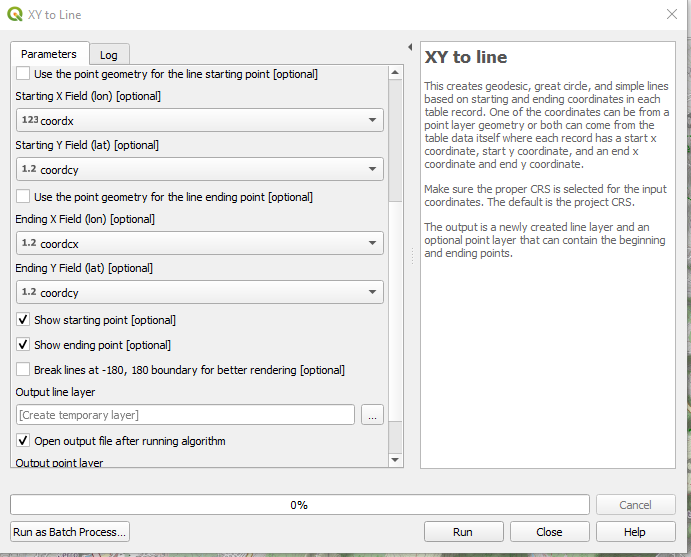 
   Figura 9. Fuente: Propia.  

  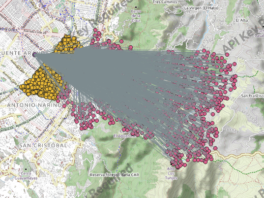 
   Figura 10. Fuente: Propia.  

  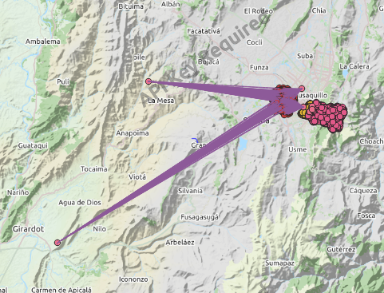 
   Figura 11. Fuente: Propia.  

Posterior a la generación de dichas distancias, se realizó una distribución de densidad de dicha población en la ciudad para validar los lugares donde debe haber más concentración de apoyo para la misma, el resultado se evidencia en la figura 12, la cual permite inferir que la mayor concentración se encuentra en el centro con una distribución radial que se expande hacia el occidente capitalino, tal como lo soportan los números. 

  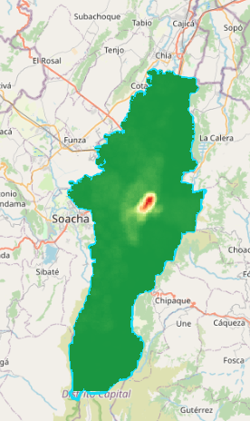 
   Figura 12. Fuente: Propia.  

Se realiza además un clip al ráster sobre la capa de Bogotá (Figura 13), sin embargo, no se obtiene el resultado deseado en su totalidad, pues el corte evidencia algunos trazos que solapan la capa inicial con la que se inició el corte; esto se atribuye al software, pues se realizó el mismo procedimiento en software licenciado (ArcMap) y el resultado del clip a la capa fue bastante fino, se realizó una búsqueda de ayuda en el repositorio de QGIS pero no existe documentación al respecto, por lo que se deja el archivo de salida tal como lo genera el software (figura 14). 

  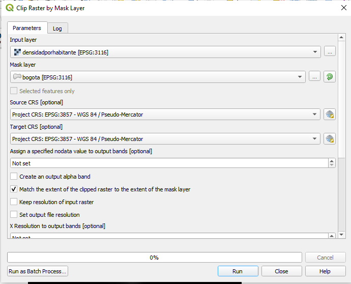 
   Figura 13. Fuente: Propia.  

  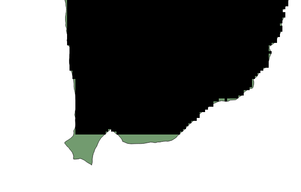 
   Figura 14. Fuente: Propia.  

4. Capa Simbología SLD

* Publicar una de las capas utilizando simbología basada en SLD
* Si utiliza QGIS para generar el SLD, favor mencionar brevemente el proceso realizado. 
* Incluir texto del SLD en el markdown del Readme.md (Ejemplo de clase https://github.com/dersteppenwolf/cartografia_web/tree/master/06_Simbologia) 
* Describir método utilizado para clasificar los datos.
* Describir el criterio para la selección de los colores a utilizar en la simbología
* Las reglas de la simbología deben incluir control de escala y etiquetado. 
* Adjuntar imagen con la leyenda de la capa.

Se realizó simbología 

5. Capa Simbología CSS

* Publicar una de las capas utilizando simbología basada en CSS
* Incluir texto del CSS en el markdown del Readme.md (Ejemplo de clase https://github.com/dersteppenwolf/cartografia_web/tree/master/06_Simbologia) 
* Describir método utilizado para clasificar los datos.
* Describir el criterio para la selección de los colores a utilizar en la simbología
* Las reglas de la simbología deben incluir control de escala y etiquetado. 
* Adjuntar imagen con la leyenda de la capa.

6. Capa Simbología YSLD

Se elige publicar simbología YSLD para las localidades de Bogotá con un label en el nombre de cada una. Se piensa una diferenciación de colores por localidades, sin embargo en un principio no se logra, por lo que la capa oficialmente publicada se muestra a continuación: 

  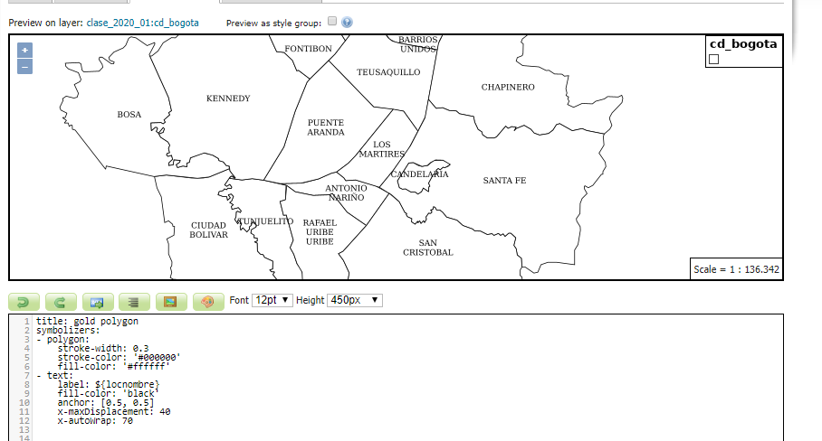 
   Figura xx. Fuente: Propia.  

El código de la etiqueta YSLD generado se muestra a continuación:

| Código para capa localidades de Bogotá    | Localización |
| -------------| -----:  |	 	
|title: gold polygon
symbolizers:
- polygon:
    stroke-width: 0.3
    stroke-color: '#000000'
    fill-color: '#ffffff'
- text:
    label: ${locnombre}
    fill-color: 'black'
    anchor: [0.5, 0.5]
    x-maxDisplacement: 40
    x-autoWrap: 70| http://34.83.176.208:18080/geoserver/web/wicket/bookmarkable/org.geoserver.wms.web.data.StyleEditPage?0&name=bogota&workspace=clase_2020_01 |

7. Grupo de capas

* Crear un **layer group** ( https://docs.geoserver.org/stable/en/user/data/webadmin/layergroups.html  ) que contenga las capas creadas en los puntos _4, 5 y 6_ y las adicionales que considere necesarias para darle contexto a la visualización (ejm. límites departamentales, límites municipales, límites internacionales, etc)
* Adjuntar el url de la previsualización _openlayers_ del conjunto de capas generada por Geoserver. Ejemplo: http://34.83.176.208:18080/geoserver/wms?service=WMS&version=1.1.0&request=GetMap&layers=tiger-ny&bbox=-74.047185%2C40.679648%2C-73.907005%2C40.882078&width=531&height=768&srs=EPSG%3A4326&format=application/openlayers 

8.  Conclusiones 

* Publicar un video en Loom ( https://www.loom.com/ ) de mínimo 5 minutos y máximo 8  donde describa brevemente lo siguiente:
* Problema planteado
* Procesamiento y análisis realizado a los datos
* Proceso de publicación de capas 
* Conclusiones del ejercicio desde el punto de vista temático según el problema definido. 
* Tutorial de loom https://support.loom.com/hc/en-us/articles/360006847737-Guide-to-Using-Loom-for-Education
* **Importante**  en el video debe quedar activa la cámara web durante todo el tiempo. Ejemplo: https://www.loom.com/share/9e89602fed3d40ff9cd3b79759ffce50

edad mínima 
y el resto?

